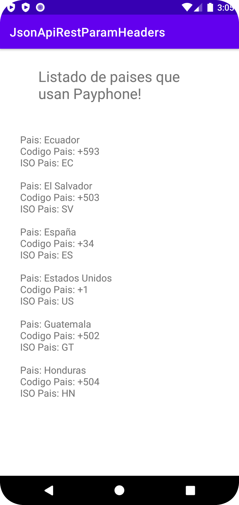

# JSON API RESTFUL ParamHeaders
 
Rino Antonio Arias Laaz 
Universidad Técnica Estatal de Quevedo 
Facultad de Ciencias de la Ingeniería 
Carrera de Ingeniería en Software 
 
 
Kotlin con Google Volley, enviando parámetros en el header 
 
 
API de prueba: PayPhone

URL de prueba: https://pay.payphonetodoesposible.com/api/Regions

Documentacion de la API: https://pay.payphonetodoesposible.com/swagger/ui/index 

 
 

 
Pantalla de inicio
 

 
Enlace incorrecto
 

 
Enlace de la api correcto
 

